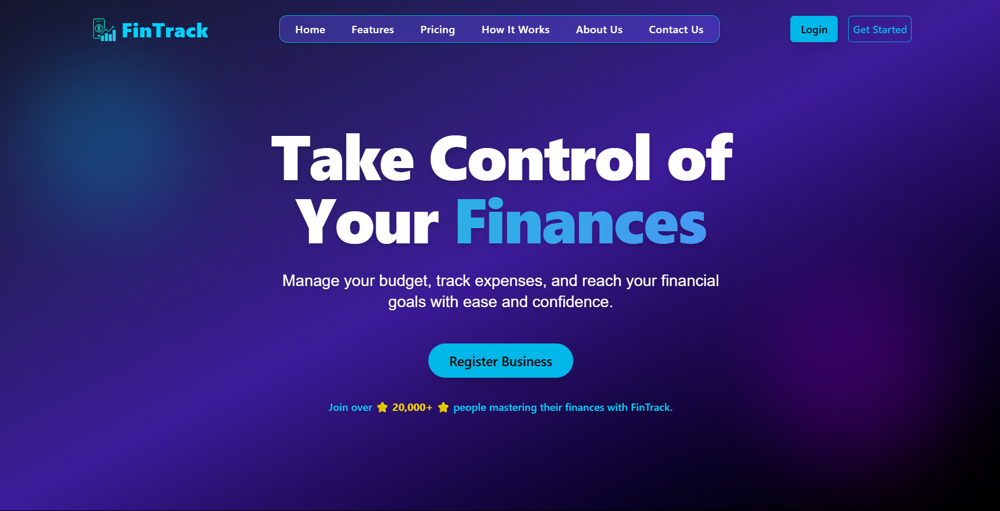

# 💰 fintrack.expense

**FinTrack** is an intuitive personal finance tracker designed to help you monitor income, expenses, savings, and spending habits — all in one clean dashboard.

> 🚧 **Note:** This project is currently **under active development**. Some features may be incomplete or in-progress.

---

## 🔧 Tech Stack

- **Frontend:** React.js / Vite + Tailwind CSS
- **Backend:** Node.js + Express.js
- **Database:** MongoDB (Mongoose)
- **Authentication:** JWT-based (in progress)

---

